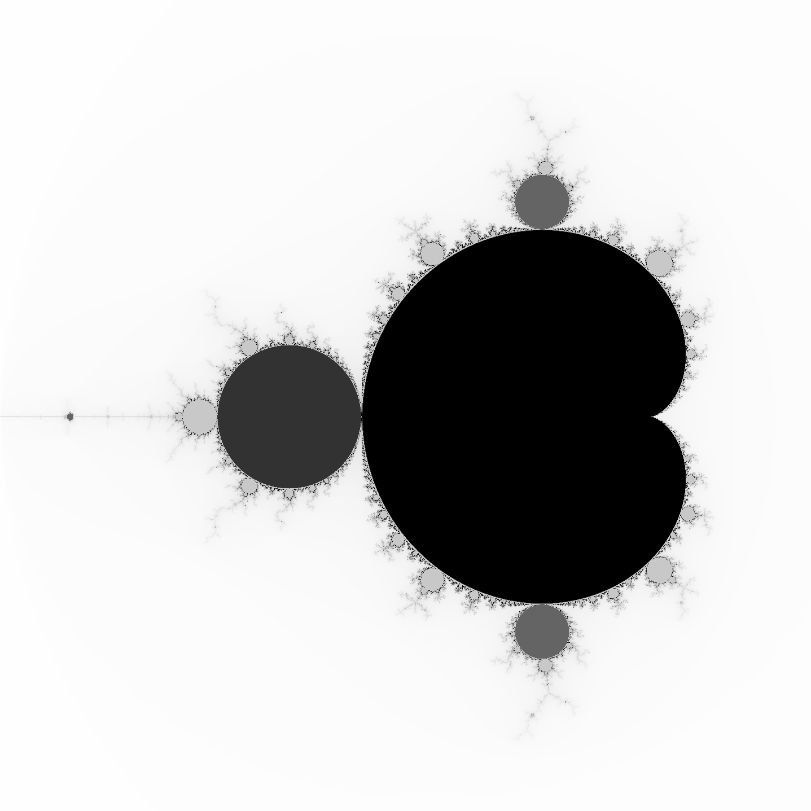
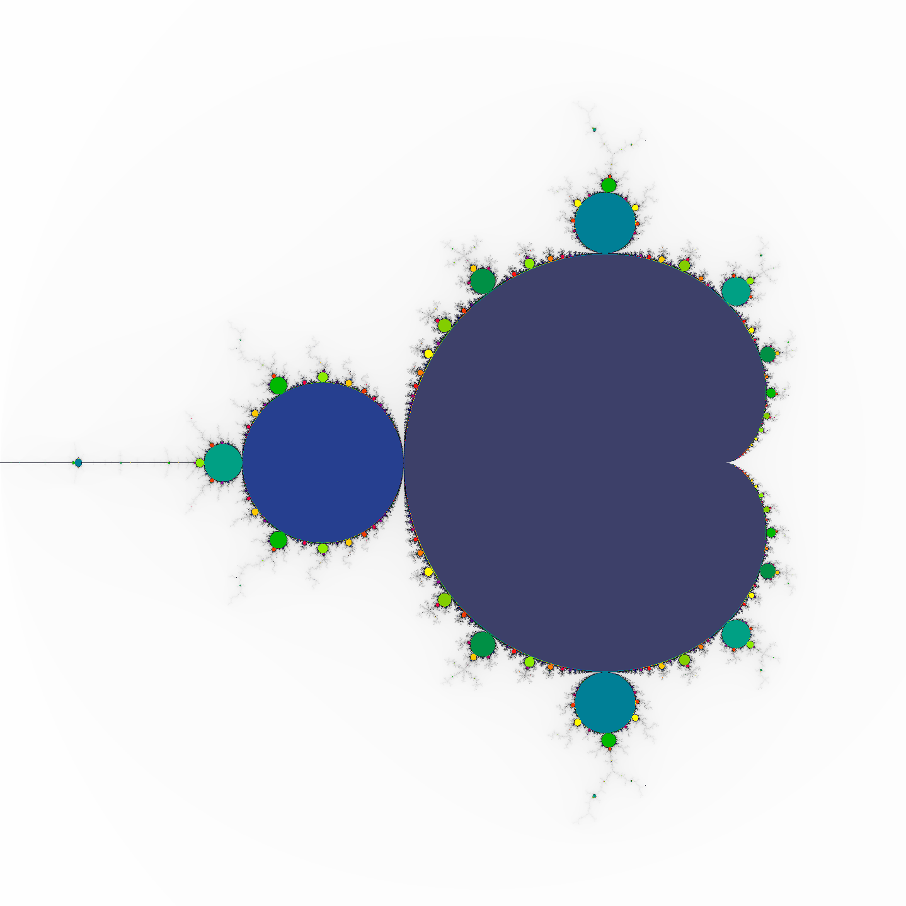
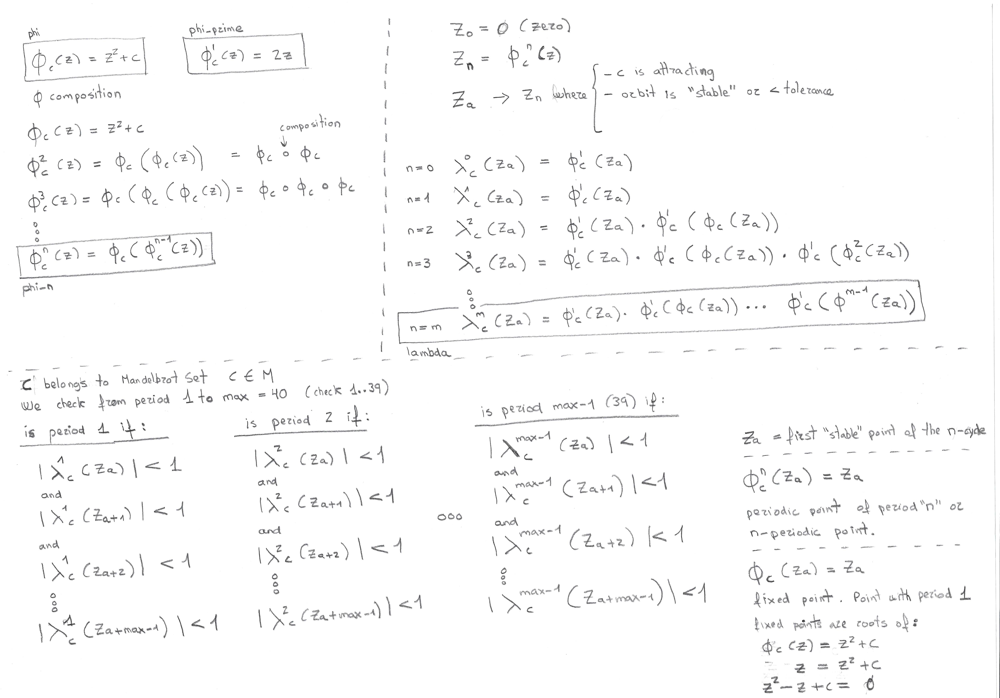

# Mandelbrot Orbits

[](https://github.com/josecelano/mandelbrot-orbits-rust/actions/workflows/test.yml) [](https://github.com/josecelano/mandelbrot-orbits-rust/actions/workflows/mega-linter.yml)

This is a small project to learn Rust.

It generates an image of the Mandelbrot Set where each pixel color represents the period of the complex point if the point belongs to the Set.

More info about [Mandelbrot Set Periods](https://github.com/josecelano/mandelbrot-explorer).

You can render it in greyscale.



Or the colorized version.



With a different color depending on the period.

## Requirements

- `cargo`: `^1.62.1`.
- `rustc`: `^1.62.1`.

## Use

```s
git clone git@github.com:josecelano/mandelbrot-orbits-rust.git
cargo run ./output/mandelbrot_2048x2048.png 2048x2048 -2.0,2.00 2.0,-2.0
```

## Development

Execute MegaLinter locally:

```s
./bin/ml.sh
```

Run tests:

```s
cargo test
```

[More info for developers](./docs/development.md).

## Math

You can find an explanation [here](https://github.com/jeremy-rifkin/mandelbrot-orbits).

And I'm trying to [find](https://math.stackexchange.com/q/4502546/1082376) and write a more formal explanation of the math behind the algorithm.



## Credits

- [Jeremy Rifkin](https://github.com/jeremy-rifkin) pointed me to the solution. I have copied/pasted part of his code to detect the period.
- [Jim Blandy, Programming Rust Book's Author](https://github.com/jimblandy).
- [Jason Orendorff, Programming Rust Book's Author](https://github.com/jorendorff).

## Links

### Repositories

- [Same thing in C++ by Jeremy Rifkin](https://github.com/jeremy-rifkin/mandelbrot-orbits).
- [Mandelbrot Trajectory Infima by Jeremy Rifkin](https://github.com/jeremy-rifkin/mandelbrot-trajectory-infima).
- [Initial code to plot the Mandelbrot Set was forked from the O'Reilly Programming Rust book](https://github.com/ProgrammingRust/mandelbrot/tree/single-threaded).
- [Mandelbrot in C language with arbitrary precision](https://github.com/josecelano/c-mandelbrot-arbitrary-precision).
- [Periodic points of a complex quadratic polynomial using Newton method by Adam Majewski](https://gitlab.com/adammajewski/periodic-points-of-complex-quadratic-polynomial-using-newton-method).
- [Numerical periodicity detection of a polynomial and rational Julia set](https://github.com/adammaj1/Describe-iterated-map-).

### Papers

- [An Introduction to Complex Dynamics and the Mandelbrot Set by professor Robert L. Benedetto](https://rlbenedetto.people.amherst.edu/talks/mhc_ug14.pdf).
- [Displaying the Internal Structure of the Mandelbrot Set by Adam Cunningham](https://www.acsu.buffalo.edu/~adamcunn/downloads/MandelbrotSet.pdf).
- [Newton's method in practice II: The iterated refinement Newton method and near-optimal complexity for finding all roots of some polynomials of very large degrees](https://arxiv.org/pdf/1703.05847.pdf).

### Books

- [The Beauty of Fractals](https://en.wikipedia.org/wiki/The_Beauty_of_Fractals).
- [Programming Rust Book, O'Reilly](https://www.oreilly.com/library/view/programming-rust-2nd/9781492052586/).
- [Mandelbook](https://mathr.co.uk/mandelbrot/book-draft-2017-11-10.pdf).

### Wikibook

- [Fractals](https://en.wikibooks.org/wiki/Fractals).

### Demos

- [Mandelbrot trajectories explorer](https://rifkin.dev/projects/mandelbrot-trajectories/).
- [Mandelbrot orbits explorer](https://mandelbrot-set-periods.online/).

### Other

- [Periodic points in the Mandelbrot set](https://www.ibiblio.org/e-notes/MSet/cperiod.htm).
- [Orbit detection for the Mandelbrot set by Mark McClure](https://observablehq.com/@mcmcclur/orbit-detection-for-the-mandelbrot-set).
