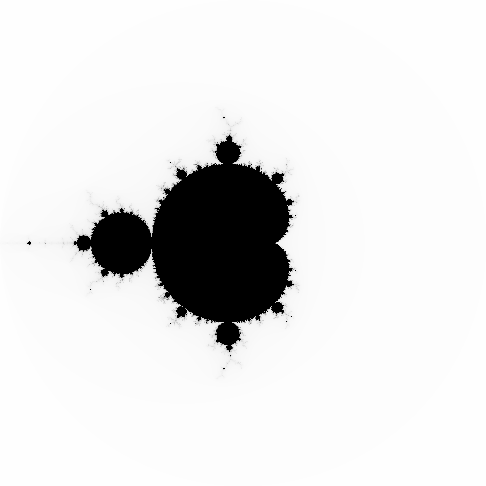

# Mandelbrot Orbits

[](https://github.com/josecelano/mandelbrot-orbits-rust/actions/workflows/test.yml) [](https://github.com/josecelano/mandelbrot-orbits-rust/actions/workflows/mega-linter.yml)

This is a small project to learn Rust.

It generates an image of the Mandelbrot Set where each pixel color represents the period of the complex point if the point belongs to the Set.

More info about [Mandelbrot Set Periods](https://github.com/josecelano/mandelbrot-explorer).

> WIP: This is a work in progress. For now, it only generates a gray scale image like this:



## Requirements

- `cargo`: ^1.62.1.
- `rustc`: ^1.62.1.

## Use

```s
git clone git@github.com:josecelano/mandelbrot-orbits-rust.git
cargo run ./output/mandelbrot_2000x2000.png 2000x2000 -2.0,2.00 2.0,-2.0
```

## Development

Execute MegaLinter locally:

```s
npx mega-linter-runner --image=oxsecurity/megalinter-rust:v6
```

## Credits

- [Jeremy Rifkin](https://github.com/jeremy-rifkin) pointed me at the solution. I have copied/pasted part of his code to detect the period.
- [Jim Blandy, Programming Rust Book's Author](https://github.com/jimblandy).
- [Jason Orendorff, Programming Rust Book's Author](https://github.com/jorendorff).

## Links

- [Same thing in C++ by Jeremy Rifkin](https://github.com/jeremy-rifkin/mandelbrot-orbits).
- [An Introduction to Complex Dynamics and the Mandelbrot Set by professor Robert L. Benedetto](https://rlbenedetto.people.amherst.edu/talks/mhc_ug14.pdf).
- [Initial code to plot the Mandelbrot Set was forked from the O'Reilly Programming Rust book](https://github.com/ProgrammingRust/mandelbrot/tree/single-threaded).
- [Programming Rust Book, O'Reilly](https://www.oreilly.com/library/view/programming-rust-2nd/9781492052586/).

