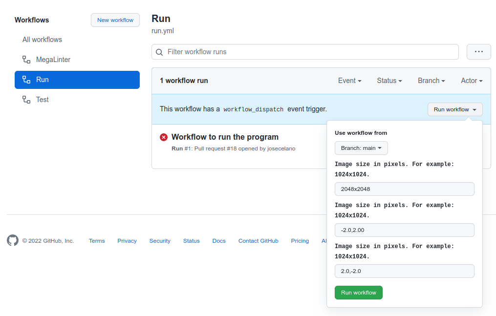
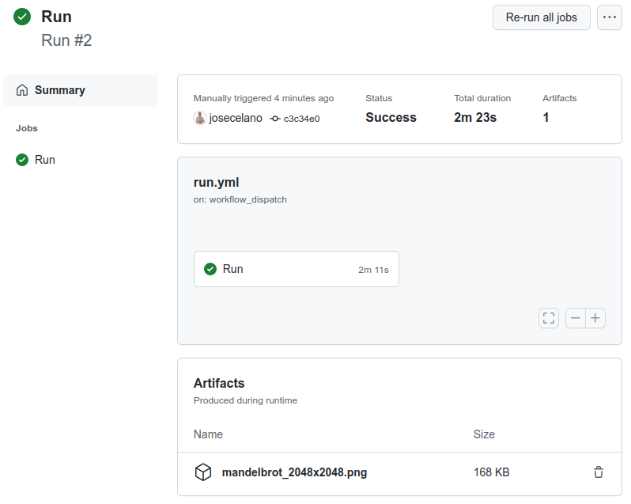

# Use

## Basic

You can clone the repo and execute the program. You have to have rust and cargo installed.

```s
git clone git@github.com:josecelano/mandelbrot-orbits-rust.git
cargo run ./output/mandelbrot_2048x2048.png 2048x2048 -2.0,2.00 2.0,-2.0
```

## Using manual triggers with workflow_dispatch

With the `run` workflow you can run the program on the Github runners.
All you need is forking the repo and trigger the workflow manually with the arguments you want.



One the workflow finishes you can download the image as an artifact.


